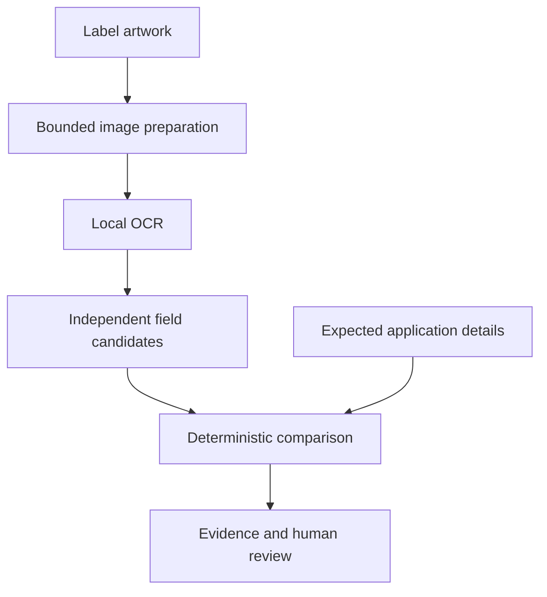

# Label Review

An independent, AI-assisted take-home prototype for the Treasury IT Specialist (AI) assessment. Reviewers enter expected application information, add alcohol-label artwork, and inspect evidence-backed text comparisons. **This is decision support, not regulatory approval, legal advice, or a COLA decision.**

## Try it locally

The review release includes `dist/` and all OCR assets. With Node.js 22.13 or newer, extract the archive, open a terminal in `label-review`, and run:

```sh
node scripts/serve.mjs
```

Open **http://127.0.0.1:4173**. No package installation, API key, account, or outbound service is needed for this prebuilt local version. Do not open `index.html` directly through `file://`: OCR workers need HTTP. The server is loopback-only by default. `HOST` and `PORT` environment variables can override it for a controlled hosting environment.

For a source checkout, install Node.js >=22.13 and the pinned pnpm version in `package.json`. Then:

```sh
pnpm install --frozen-lockfile
pnpm build
pnpm start
```

For development, run `pnpm build` once to copy the OCR assets, then `pnpm dev`. Use the URL Vite prints. Installation requires access to the package registry; **running a prepared build requires only its own origin**. Root-path hosting is required in this release.

## Review workflow

1. Select an included synthetic example and **Load example**, or enter application details and **Choose images**.
2. Check that all front/back/side panels belong to that application.
3. Select **Compare label**. The first comparison initializes an OCR worker; subsequent comparisons reuse it.
4. Expand each finding to see the expected value, extracted candidate, reasoning, and OCR confidence. **Show image evidence** highlights the supporting text.
5. Inspect typography, required placement, beverage-specific requirements, and all uncertain findings. Even a Match can contain OCR or field-selection errors.
6. **Clear session** removes application references, artwork, results, and queued applications from page state.

Use **Add to batch** to snapshot the current details and artwork. Each entry is independent. Prepare the next application, add it, then **Compare queued applications**. This deliberately bounded queue supports **10 applications / 50 MB prepared artwork**, not the stakeholder's 200–300-label production workload. There is no bulk CSV import. A failed job does not prevent later jobs from running. Cancel leaves unprocessed jobs queued.

## Features and scope

- English-language OCR of PNG, JPEG, and still WebP images; up to four panels per application.
- Brand, class/type, alcohol percentage, net contents, business name/address statement, imported-product country of origin, and prescribed warning text.
- Match, Mismatch, Unable to Verify, and Manual Review outcomes with evidence and reasons.
- Multi-panel evidence, rotation, enlargement, progress, cancellation, timeout, input validation, and safe image errors.
- Real synthetic-label examples, including discrepancies, uppercase/title-case warning headings, a two-panel product, an import, conflicting percentages, blur, and blank artwork.
- No accounts, review database, analytics, external AI API, or automatic approval/rejection.

## Architecture and choices



- **React + TypeScript + Vite:** a static, typed application with semantic form controls and reusable accessible UI primitives. No backend is needed for the task.
- **Tesseract.js 6 / WebAssembly:** pretrained neural OCR in a browser worker. English model, worker, and WASM are copied from locked dependencies and served from the same origin. No paid inference API, runtime credential, or model endpoint is used.
- **Deterministic comparison:** auditable rules keep recognition separate from application expectations. The expected brand/value is never fed into OCR or candidate extraction. This prevents expected answers from becoming fabricated evidence.
- **Conservative uncertainty:** recognition confidence gates automatic comparison; multiple candidates or unsupported cases require review. Confidence scores are not calibrated probabilities.
- **Sequential queue:** one reusable worker controls memory and avoids saturating modest devices. Parallelism and durable processing are deferred.

The repository originated from a Sites UI starter. Its UI catalog and locked development dependencies are retained; Next/Vinext, Drizzle, D1, and authentication are **not in the active application path**. Production is the Vite static `dist/` output. There is no database binding or COLA integration. See [Architecture and tradeoffs](docs/ARCHITECTURE.md).

## Source map

| Path | Responsibility |
|---|---|
| `components/review/workspace.tsx` | Forms, artwork preparation, workflow, cancellation, independent batch snapshots |
| `components/review/findings.tsx` | Outcomes, explanations, evidence actions, raw OCR |
| `lib/review/images.ts` | Byte signatures, dimension/size limits, rasterization, object-URL lifetime |
| `lib/review/ocr.ts` | Worker lifecycle, same-origin assets, timeout, confidence/bounding-box mapping |
| `lib/review/rules.ts` | Independent candidate extraction, validation, comparison, warning rules |
| `lib/review/samples.ts` | Synthetic example inputs; no precomputed OCR results |
| `scripts/` and `tests/` | Build assets, local serving, fixture generation, tests, release packaging |
| `docs/` and `reports/` | Requirements, decision record, regulatory scope, verification evidence, submission guide |

## Verification rules

| Case | Behavior |
|---|---|
| Ordinary text | Unicode NFKC; case-fold; collapse whitespace/punctuation; normalize curly apostrophes; remove apostrophes; normalize `&` to `and`. Preserve accents and word boundaries. No fuzzy match. |
| Alcohol content | Require recognizable alcohol/volume context; compare exact numerical declarations. Do not apply manufacturing tolerances to application-vs-label matching. Ranges and inequalities require review. |
| Proof | Do not infer a missing percentage from proof alone. Inconsistent or uncertain proof escalates an otherwise matching percentage. |
| Volume | Convert mL/cL/L exactly. US fl oz remains a separate measurement system; mixed or multiple quantities require review. Does not validate legal fill standards. |
| Government warning | Preserve words, numbering, punctuation, and uppercase `GOVERNMENT WARNING:` heading. Collapse layout whitespace; body case is ignored. Never use ordinary name normalization here. |
| Confidence | Every supporting line must have confidence >=80 and every recognized word >=55 for automatic comparison. These heuristic thresholds need calibration on representative real artwork. |
| Missing candidate | Unable to Verify: absent OCR evidence does not establish that label information is absent. |
| Ambiguous candidate | Manual Review: distinct candidates, low confidence, complex units, or conditional applicability. |
| Visual requirements | Always Manual Review: bold heading, non-bold body, physical type size, legibility, contrast, separation, required placement, and broader category rules. |

The chosen comparison rules are engineering heuristics, **not interpretations that authorize a regulatory outcome**. A high-confidence wrong OCR reading can still Match or Mismatch incorrectly. Extraction uses line patterns and relative text height; unusual brand names, multiple lines, decorative layouts, multilingual text, and disjoint business statements can fail. See [Regulatory scope](docs/REGULATORY.md).

## Tests and reproducibility

```sh
pnpm test          # rule, image-header, validation, and static-server checks
pnpm test:ocr      # above plus actual Tesseract OCR on the included images
pnpm typecheck
pnpm build
```

Fixtures are included in source. To regenerate them on Linux with Python 3, Pillow, and DejaVu Sans fonts:

```sh
python3 scripts/generate-fixtures.py
```

The exact-text images are drawn programmatically to create reliable ground truth. They are fictitious and visibly marked as synthetic. They are representative **text-comparison cases**, not examples certified to comply with every labeling requirement (for example, wine sulfites and bourbon age details are outside automated scope).

`tests/browser-harness.html` is a development-only accessibility/layout/privacy audit harness. With the development server running, open `/tests/browser-harness.html`, use the application in the frame, and select **Audit current state**. It is excluded from production output. Browser checks and their limits are recorded in [Verification](docs/VERIFICATION.md); actual OCR evidence is in `reports/ocr-results.json`.

## Performance

The requirement is approximately five seconds, not a promise on all devices. The release measures elapsed time from starting OCR (including worker initialization when cold) through comparison; file selection and image preparation occur earlier. Multiple panels accumulate time. A 25-second **per-panel** deadline and cancellation prevent indefinite waits; after five seconds the UI explicitly tells the reviewer the target has been exceeded.

Recorded synthetic timings and environment details appear in the verification report. A small synthetic corpus is not an accuracy study, load test, or proof of production throughput. Registry downloads are build-time costs; initial application/model downloads still depend on the deployment network and browser cache.

## Privacy and security

- Selected files are read by the browser File API and processed in memory. Neither artwork nor application details nor extracted text is sent to the server.
- No localStorage, sessionStorage, review IndexedDB, service worker, cookies, or persisted queue is created by the application. Tesseract language-data caching is disabled. Ordinary browser HTTP caching can retain public app/model files.
- Clear/session teardown revokes object URLs and terminates the worker; garbage collection and memory erasure timing are controlled by the browser. This is not a guarantee of cryptographic erasure or protection against extensions, malware, screenshots, or device forensics.
- Same-origin OCR assets remove the need for an external inference service. The host can still log ordinary page/asset requests and IP addresses. Follow official-reference links only when desired.
- Limits: 10 MB encoded per image, 20 megapixels, 8,000 pixels per side, at least 100 pixels per side; images shrink to at most 2,200 pixels on the longest edge for OCR. Byte signatures/dimensions are checked before decoding, and decoded dimensions are checked again. Reject PDF, SVG, HEIC, animated WebP, type mismatches, and malformed input. Header checks are a resource safeguard, not a full malware detector.
- Untrusted recognized text is rendered as text through React. It is not HTML, a prompt to an LLM, or an executable instruction.
- The local static server accepts GET/HEAD only, confines served paths to `dist/`, and supplies CSP, nosniff, no-referrer, and permissions headers. Static hosts must apply equivalent policies; verify them after publication.
- Only public/synthetic data belongs in this prototype. No trading code, employer information, IRS data, personal credentials, or secrets is included. No production federal authorization is claimed.

## Accessibility

Explicit labels, keyboard-operable inputs/accordions, visible focus, a skip link, live status/error announcements, focused validation/results, and text/icon status indicators support varied reviewer needs. Image evidence also has extracted text and reasoning; color is not the sole signal. Responsive layouts and enlarged text are checked. Automated axe results are only a partial assessment: real assistive-technology testing and a formal Section 508/WCAG evaluation remain production work.

## Deployment and submission status

The [source repository](https://github.com/daoc0re/alcohol-label-review-submission) and [working application](https://alcohol-label-review.alexander-d-dao.chatgpt.site) are public. The assessment form has not been submitted. See [Submission checklist and walkthrough](docs/SUBMISSION.md).

The static `dist/` output is hosted at its root over HTTPS. Its OCR assets are served from the same origin. This Site is a prototype with synthetic examples; it has no production federal authorization.

## Assumptions, limitations, and production improvements

English, clear flat artwork, modern browser with WebAssembly/workers and `createImageBitmap`, and a human reviewer are assumed. Severe blur, glare, curvature, perspective, vertical text, unsupported designation wording, or unreadable numbers are not repaired or guessed. Rotation is manual in 90-degree increments. No handwriting recognition, perspective correction, PDF import, legal class determination, exhaustive country aliases, physical measurement, or fine-tuned model is claimed.

Priority improvements: an independently labeled real-world evaluation corpus and calibrated confidence/field accuracy; reviewer corrections and auditable adjudication; more robust layout segmentation and vocabulary; accessible screen-reader testing; target-device timing percentiles; configurable versioned rules approved by subject-matter experts; managed batching with retention, access, audit, and authorization decisions; then carefully governed COLA integration. See the architecture record for alternatives and tradeoffs.

## AI assistance and tools

OpenAI ChatGPT/Codex assisted with requirements analysis, official-source research, architecture, implementation, test design, debugging, documentation, and release preparation. This is disclosed rather than presented as unaided authorship. The applicant must review and understand the work before submitting. Runtime AI is the pretrained Tesseract OCR model; there is no runtime generative-model call, custom model training, or claim of a new AI model. Other tools include React, TypeScript, Vite, Tesseract.js, Radix/shadcn UI primitives, Tailwind, Lucide, Node's test runner, Python/Pillow, axe-core, and browser automation for local verification. See [Third-party notices](THIRD_PARTY_NOTICES.md) and the generated `public/THIRD_PARTY_LICENSES.txt` inventory.

## Official references

Reviewed September 23, 2026. The complete [assessment instructions](https://github.com/treasurytakehome-rgb/instructions) supplied by the applicant were the authoritative brief. Stakeholder workload figures are assignment context, not independently verified agency statistics.

- [27 CFR Part 16: alcohol beverage health warning](https://www.ecfr.gov/current/title-27/chapter-I/subchapter-A/part-16), especially §§16.10, 16.21, 16.22.
- [TTB distilled spirits mandatory label information](https://www.ttb.gov/regulated-commodities/beverage-alcohol/distilled-spirits/ds-labeling-home/ds-brand-label) and [27 CFR Part 5, Subpart E](https://www.ecfr.gov/current/title-27/chapter-I/subchapter-A/part-5/subpart-E).
- [TTB wine alcohol content](https://www.ttb.gov/regulated-commodities/beverage-alcohol/wine/wine-labeling-alcohol-content) and [27 CFR §4.36](https://www.ecfr.gov/current/title-27/chapter-I/subchapter-A/part-4/subpart-D/section-4.36).
- [TTB malt beverage alcohol content](https://www.ttb.gov/regulated-commodities/beverage-alcohol/beer/labeling/malt-beverage-alcohol-content) and [mandatory information](https://www.ttb.gov/regulated-commodities/beverage-alcohol/beer/labeling/malt-beverage-mandatory-label-information).

Rules and applicability can change. These references support the documented review boundary; they do not turn this prototype into a comprehensive compliance system.
